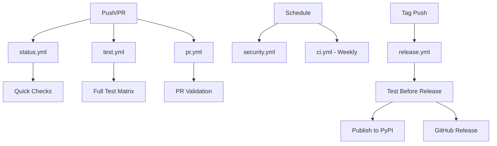

# GitHub Actions Workflows

This document describes the CI/CD workflows configured for `django-create-initial-user`.

## Workflow Files

### 🧪 `test.yml` - Main Test Suite
**Triggers:** Push to main/develop, Pull Requests, Manual dispatch

**Purpose:** Comprehensive testing across Python and Django versions

**Jobs:**
- **test** - Tests all combinations of Python (3.9-3.12) and Django (4.2-5.1)
- **lint** - Code formatting, linting, and type checking
- **security** - Security scans with Bandit and Safety
- **build** - Package building and validation
- **test-package** - Tests the built package installation

**Matrix:**
```yaml
python-version: ["3.9", "3.10", "3.11", "3.12"]
django-version: ["4.2", "5.0", "5.1"]
```

### 🚀 `ci.yml` - Comprehensive CI
**Triggers:** Push to main/develop, PRs, Weekly schedule, Manual dispatch

**Purpose:** Flexible CI with different test modes

**Jobs:**
- **quick-test** - Single version test (manual dispatch only)
- **comprehensive-test** - Full matrix test (automatic triggers)
- **test-status** - Status reporting

**Features:**
- Manual version selection via workflow dispatch
- Weekly scheduled runs for dependency drift detection
- Coverage reporting with Codecov integration

### 🔍 `pr.yml` - Pull Request Validation
**Triggers:** PR opened/updated/reopened

**Purpose:** Targeted validation for pull requests

**Jobs:**
- **changes** - Detects what changed (code/tests/docs)
- **test-pr** - Runs tests only if code/tests changed
- **lint-pr** - Linting and formatting checks
- **comment-coverage** - Posts coverage report as PR comment

**Features:**
- Path-based filtering to avoid unnecessary runs
- Coverage artifacts uploaded for review
- Automated PR comments with coverage data

### ✅ `status.yml` - Required Status Checks
**Triggers:** PRs and pushes to main/develop

**Purpose:** Fast essential checks for merge requirements

**Jobs:**
- **required-checks** - Django config, imports, quick tests

**Features:**
- Minimal but essential validation
- Fast execution for quick feedback
- Suitable for branch protection rules

### 🔒 `security.yml` - Security and Dependencies
**Triggers:** Daily schedule, Manual dispatch, dependency changes

**Purpose:** Security scanning and dependency management

**Jobs:**
- **security-scan** - Bandit and Safety scans
- **dependency-review** - GitHub dependency review (PRs)
- **test-latest-dependencies** - Test with latest dependency versions
- **create-issue-on-failure** - Auto-create issues for security failures

**Features:**
- Daily automated security scans
- Dependency vulnerability detection
- Automatic issue creation for failures
- JSON reports uploaded as artifacts

### 📦 `release.yml` - Release Management
**Triggers:** Git tags starting with 'v', Published releases

**Purpose:** Release validation and publishing

**Jobs:**
- **test-before-release** - Full test matrix before release
- **build-and-publish** - Build and publish to PyPI
- **create-github-release** - Create GitHub release with changelog

**Features:**
- Pre-release validation across all supported versions
- Automatic PyPI publishing with API tokens
- GitHub release creation with changelog extraction
- Release artifact uploads

## Security Configuration

### Required Secrets
- `PYPI_API_TOKEN` - For publishing to PyPI
- `CODECOV_TOKEN` - For coverage reporting (optional)

### Branch Protection
Recommended branch protection rules for `main`:
- Require status checks: "Required Status Checks"
- Require up-to-date branches
- Require linear history
- Include administrators

## Coverage Reporting

### Codecov Integration
- Coverage reports uploaded on Python 3.11 + Django 4.2 matrix
- PR comments with coverage changes
- HTML coverage reports as artifacts
- Configurable via `.coveragerc`

### Coverage Targets
- Minimum coverage enforced via configuration
- Missing lines reported in terminal output
- HTML reports for detailed analysis

## Workflow Dependencies



## Usage Examples

### Running Manual Tests
```bash
# Quick test with specific versions
gh workflow run ci.yml -f python-version=3.11 -f django-version=5.0

# Full test suite
gh workflow run test.yml
```

### Monitoring Security
```bash
# Check latest security scan
gh run list --workflow=security.yml --limit 1

# Download security reports
gh run download --dir security-reports
```

### Release Process
```bash
# Tag and push (triggers release workflow)
git tag v1.2.3
git push origin v1.2.3

# Check release status
gh run list --workflow=release.yml
```

## Troubleshooting

### Common Issues
1. **Test failures in matrix** - Check Django version compatibility
2. **Security scan failures** - Review Bandit/Safety reports in artifacts
3. **Coverage drops** - Check coverage report in PR comments
4. **Import errors** - Verify package installation in test-package job

### Debug Tips
1. Use workflow dispatch for targeted testing
2. Check artifact downloads for detailed reports
3. Review job summaries for quick status overview
4. Monitor weekly runs for dependency drift

## Maintenance

### Regular Tasks
- Review and update Python/Django version matrix
- Update security scan schedules as needed
- Monitor coverage trends and adjust targets
- Update branch protection rules as workflows evolve

### Dependency Updates
- Dependencies are scanned daily via security workflow
- Manual updates can be tested via workflow dispatch
- Version matrix should be updated quarterly
