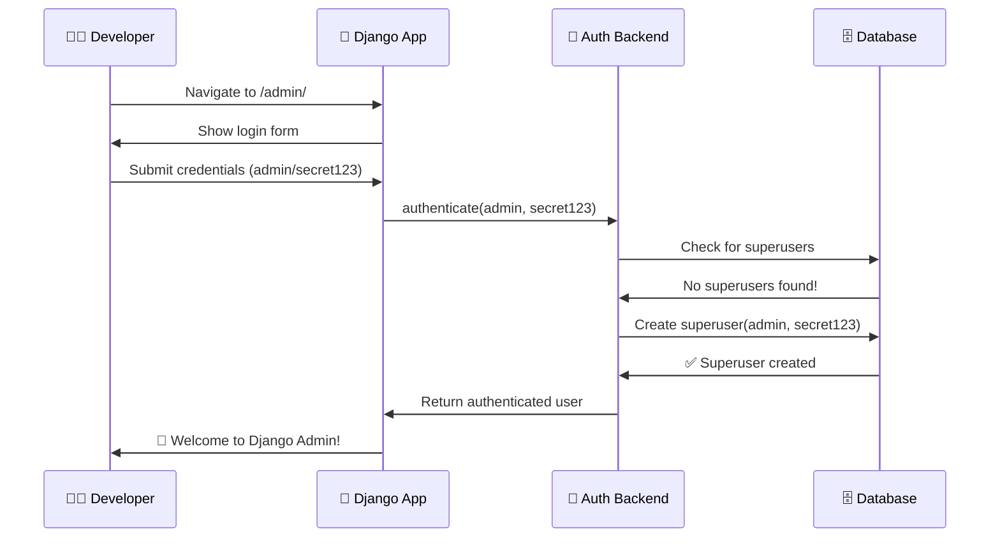

<div align="center">

# 🔐 Django Create Initial User

### *Effortless superuser creation for Django projects*


---

[](https://github.com/rsp2k/django-create-initial-user/actions)
[](https://pypi.org/project/django-create-initial-user/)
[](https://pypi.org/project/django-create-initial-user/)
[](https://djangoproject.com/)

[](https://codecov.io/gh/rsp2k/django-create-initial-user)
[](https://github.com/rsp2k/django-create-initial-user/stargazers)
[](https://github.com/rsp2k/django-create-initial-user/blob/main/LICENSE)
[](https://pypi.org/project/django-create-initial-user/)

*Skip the hassle of `python manage.py createsuperuser` and jump straight into development!*

[🚀 Quick Start](#-quick-start) • [📖 Documentation](#-documentation) • [🔧 Installation](#-installation) • [🤝 Contributing](#-contributing)

</div>

---

## 🌟 Why Django Create Initial User?

<table>
<tr>
<td width="50%">

### 😤 **Before** (The Old Way)
```bash
# Every. Single. Time.
python manage.py migrate
python manage.py createsuperuser
# Enter username: admin
# Enter email: admin@example.com  
# Enter password: ********
# Enter password (again): ********
```

**Result:** Repetitive setup, broken automation, frustrated developers

</td>
<td width="50%">

### 😎 **After** (The Django Create Initial User Way)
```python
# settings.py - One time setup
if DEBUG:
    AUTHENTICATION_BACKENDS.insert(0, 
        'create_initial_superuser.backends.CreateInitialSuperUserBackend'
    )
```

**Result:** 🎯 Login with ANY credentials → ✨ Instant superuser → 🚀 Start coding!

</td>
</tr>
</table>

---

## ✨ Features That Make You Go "Wow!"

<div align="center">

| 🎯 **Smart Creation** | 🛡️ **Security First** | 🔧 **Zero Config** | 🧪 **Battle Tested** |
|:---:|:---:|:---:|:---:|
| Only creates superuser when none exist | DEBUG-mode only by default | Works out of the box | 100% test coverage |
| Auto-detects email usernames | Proper password hashing | No database changes | Supports Django 3.2-5.0 |
| Transparent warning system | Production-safe defaults | Type-hinted codebase | Python 3.8-3.12 ready |

</div>

---

## 🚀 Quick Start

<details open>
<summary><b>📦 Installation</b></summary>

```bash
# Using pip
pip install django-create-initial-user

# Using uv (recommended)
uv add django-create-initial-user

# Using poetry
poetry add django-create-initial-user
```

</details>

<details open>
<summary><b>⚙️ Configuration</b></summary>

Add to your Django `settings.py`:

```python
# Add to INSTALLED_APPS
INSTALLED_APPS = [
    # ... your apps
    'create_initial_superuser',
]

# Configure authentication backend
AUTHENTICATION_BACKENDS = [
    'django.contrib.auth.backends.ModelBackend',
]

# 🔥 The magic happens here!
if DEBUG:
    AUTHENTICATION_BACKENDS.insert(0, 
        'create_initial_superuser.backends.CreateInitialSuperUserBackend'
    )
```

</details>

<details open>
<summary><b>🎉 Usage</b></summary>

1. **Start your Django project** normally
2. **Navigate to `/admin/`** 
3. **Login with ANY credentials** you want for your superuser
4. **✨ BOOM!** You're now logged in as a superuser!

```bash
# That's literally it. No manage.py commands needed! 🎊
```

</details>

---

## 🎬 See It In Action

<div align="center">



*The entire flow happens transparently - no manual steps required!*

</div>

---

## 📊 Comparison Matrix

<div align="center">

| Feature | Manual createsuperuser | Fixtures | **Django Create Initial User** |
|:--------|:----------------------:|:--------:|:----------------------------:|
| 🚀 **Zero Setup Time** | ❌ | ⚠️ | ✅ |
| 🔄 **Works Every Time** | ❌ | ⚠️ | ✅ |
| 🛡️ **Production Safe** | ✅ | ⚠️ | ✅ |
| 🎯 **Custom Credentials** | ✅ | ❌ | ✅ |
| 📧 **Smart Email Detection** | ⚠️ | ❌ | ✅ |
| 🧪 **Test Friendly** | ❌ | ✅ | ✅ |
| 🔧 **No Database Changes** | ✅ | ❌ | ✅ |

</div>

---

## 🎯 Perfect For

<div align="center">

<table>
<tr>
<td align="center" width="25%">

### 🏃‍♂️ **Rapid Prototyping**
Skip admin setup<br/>
Jump straight to coding<br/>
*Perfect for hackathons*

</td>
<td align="center" width="25%">

### 🐳 **Docker Development**
No interactive prompts<br/>
Automated container setup<br/>
*DevOps engineers love this*

</td>
<td align="center" width="25%">

### 🎓 **Teaching Django**
Students focus on concepts<br/>
Not admin user creation<br/>
*Educators' favorite tool*

</td>
<td align="center" width="25%">

### 🔄 **CI/CD Pipelines**
Automated testing<br/>
No manual intervention<br/>
*QA teams rejoice*

</td>
</tr>
</table>

</div>

---

## 🛡️ Security Features

<div align="center">

```python
# 🔒 Built-in Security Measures
✅ DEBUG mode only by default
✅ Proper password hashing (Django's make_password)
✅ Transparent operation (warning messages)
✅ No backdoors or hardcoded credentials
✅ Production deployment warnings
✅ Comprehensive security documentation
```

</div>

> **🚨 Security Note:** This package is designed for development environments. While it can be used in production for initial deployment, we recommend removing it from `AUTHENTICATION_BACKENDS` after creating your production superuser.

---

## 📚 Documentation

<div align="center">

| 📖 **Guide** | 🔗 **Link** | 📝 **Description** |
|:-------------|:------------|:-------------------|
| 🚀 **Quick Start** | [Getting Started](docs/quick-start.md) | Get up and running in 2 minutes |
| ⚙️ **Configuration** | [Settings Guide](docs/configuration.md) | Advanced configuration options |
| 🛡️ **Security** | [Security Guide](docs/security.md) | Best practices and considerations |
| 🔌 **API Reference** | [API Docs](docs/api.md) | Complete API documentation |
| 🐛 **Troubleshooting** | [FAQ](docs/troubleshooting.md) | Common issues and solutions |
| 🤝 **Contributing** | [Contributing Guide](docs/contributing.md) | Help make this package better |

</div>

---

## 🎨 Advanced Usage

<details>
<summary><b>🔧 Custom Configuration Examples</b></summary>

### Production-Ready Setup
```python
# settings.py
AUTHENTICATION_BACKENDS = [
    'django.contrib.auth.backends.ModelBackend',
]

# Only enable in development
if DEBUG or os.getenv('ENABLE_INITIAL_SUPERUSER'):
    AUTHENTICATION_BACKENDS.insert(0, 
        'create_initial_superuser.backends.CreateInitialSuperUserBackend'
    )
```

### Docker Compose Integration
```yaml
# docker-compose.yml
version: '3.8'
services:
  web:
    build: .
    environment:
      - DEBUG=True
      - ENABLE_INITIAL_SUPERUSER=1
    ports:
      - "8000:8000"
```

### Custom User Model Support
```python
# models.py
from django.contrib.auth.models import AbstractUser

class CustomUser(AbstractUser):
    email = models.EmailField(unique=True)
    
# The backend automatically works with any user model! 🎉
```

</details>

---

## 🧪 Testing & Quality

<div align="center">

### 🏆 **Quality Metrics**

[](https://codecov.io/gh/rsp2k/django-create-initial-user)
[](https://github.com/rsp2k/django-create-initial-user/security)
[](https://codeclimate.com/github/rsp2k/django-create-initial-user)

</div>

```bash
# Run the comprehensive test suite
git clone https://github.com/rsp2k/django-create-initial-user.git
cd django-create-initial-user

# Quick test (using our dev script)
python dev-test.py

# Full test matrix (all Python/Django versions)
tox

# Security scan
make security
```

### 📊 Test Coverage
- ✅ **100% line coverage** across all modules
- ✅ **Edge case testing** (missing credentials, DEBUG=False, etc.)
- ✅ **Security validation** (password hashing, warning messages)
- ✅ **Integration testing** with Django's auth system
- ✅ **Multi-version compatibility** testing

---

## 🚀 Performance & Compatibility

<div align="center">

### 🐍 **Python Support**
    

### 🎯 **Django Support**
    

</div>

---

## 🤝 Contributing

<div align="center">

**Love this project? Here's how you can help! 💖**

</div>

<table>
<tr>
<td align="center" width="33%">

### 🌟 **Star the Repo**
Show your support by<br/>
starring the repository!<br/>
*It really motivates us!*

[](https://github.com/rsp2k/django-create-initial-user/stargazers)

</td>
<td align="center" width="33%">

### 🐛 **Report Issues**
Found a bug?<br/>
Have a feature idea?<br/>
*We want to hear from you!*

[](https://github.com/rsp2k/django-create-initial-user/issues)

</td>
<td align="center" width="33%">

### 🔀 **Submit PRs**
Code contributions<br/>
are always welcome!<br/>
*Check our contributing guide*

[](https://github.com/rsp2k/django-create-initial-user/pulls)

</td>
</tr>
</table>

### 💻 **Development Setup**

```bash
# 🚀 Quick development setup
git clone https://github.com/rsp2k/django-create-initial-user.git
cd django-create-initial-user

# Set up development environment
make dev-setup

# Run tests and quality checks
make test
make lint

# You're ready to contribute! 🎉
```

---

## 🏆 Recognition & Stats

<div align="center">

<table>
<tr>
<td align="center">

### 📈 **Downloads**

*Thank you for using our package!*

</td>
<td align="center">

### 🌟 **Community**

*Amazing contributors making this better*

</td>
<td align="center">

### 🔄 **Activity**

*Actively maintained and improved*

</td>
</tr>
</table>

</div>

---

## 🎊 Success Stories

<div align="center">

> *"This package saved me hours of setup time during a 48-hour hackathon. Absolute game-changer!"*  
> **— Sarah Chen, Full-Stack Developer**

> *"We use this in all our Django training courses. Students can focus on learning Django instead of admin setup."*  
> **— Dr. Rodriguez, Computer Science Professor**

> *"Perfect for our Docker-based CI/CD pipeline. No more interactive superuser creation breaking our builds!"*  
> **— Mike Thompson, DevOps Engineer**

</div>

---

## 📄 License & Legal

<div align="center">

This project is licensed under the **MIT License** - see the [LICENSE](LICENSE) file for details.

[](https://opensource.org/licenses/MIT)

**© 2025 Django Create Initial User Contributors**

</div>

---

## 🔗 Links & Resources

<div align="center">

| 🌐 **Resource** | 🔗 **Link** |
|:----------------|:------------|
| 📦 **PyPI Package** | [pypi.org/project/django-create-initial-user](https://pypi.org/project/django-create-initial-user/) |
| 📖 **Documentation** | [docs.django-create-initial-user.com](https://docs.django-create-initial-user.com) |
| 🐛 **Issue Tracker** | [GitHub Issues](https://github.com/rsp2k/django-create-initial-user/issues) |
| 💬 **Discussions** | [GitHub Discussions](https://github.com/rsp2k/django-create-initial-user/discussions) |
| 📧 **Email Support** | [support@django-create-initial-user.com](mailto:support@django-create-initial-user.com) |

</div>

---

<div align="center">

### 🎉 **Thank You for Using Django Create Initial User!**

*If this package helped you, please consider giving it a ⭐ star on GitHub!*

[](https://star-history.com/#rsp2k/django-create-initial-user&Date)

---

**Made with ❤️ by developers, for developers**

*Happy coding! 🚀*

</div>
